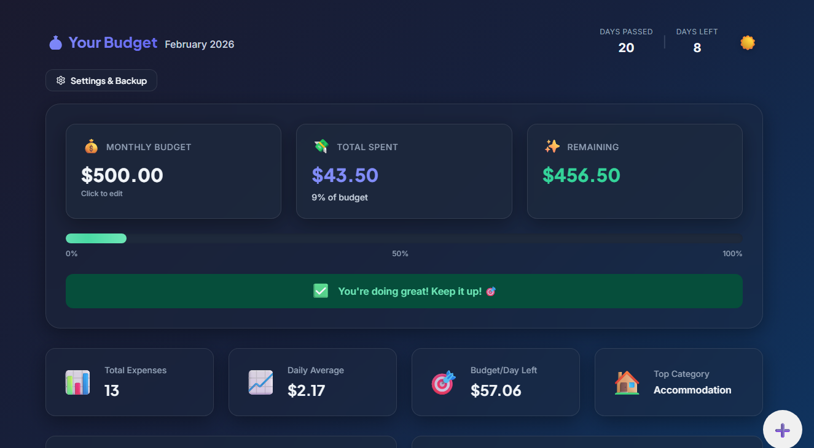
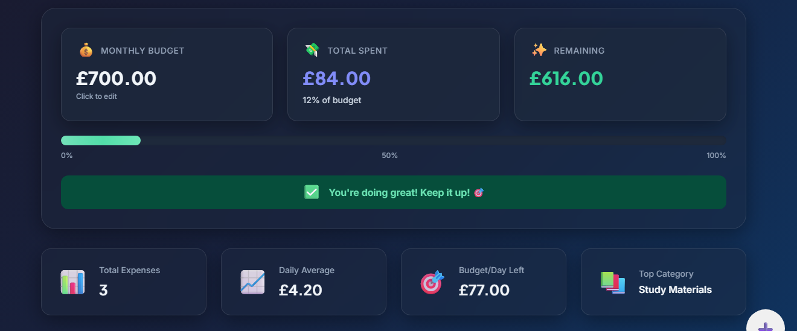
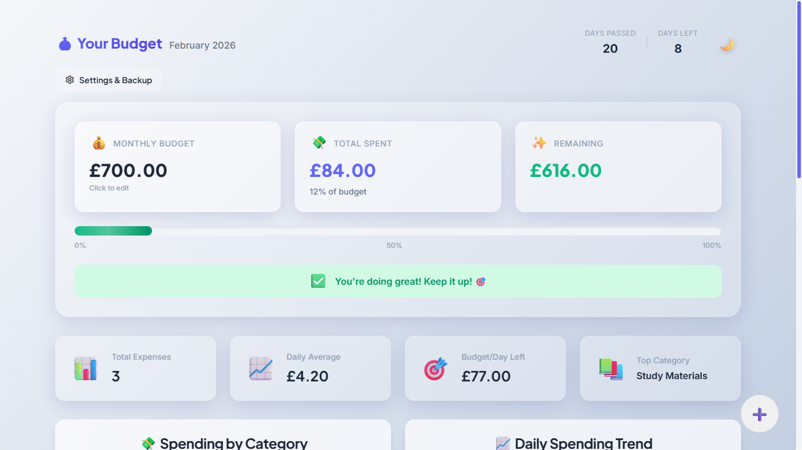
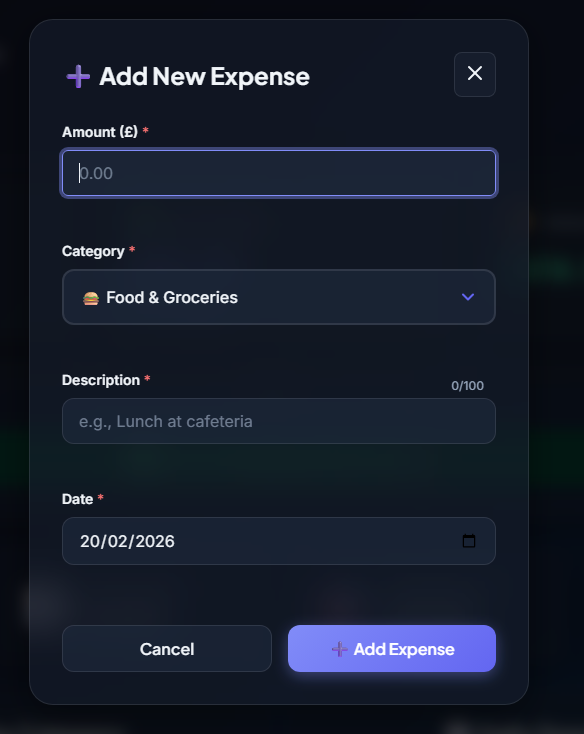
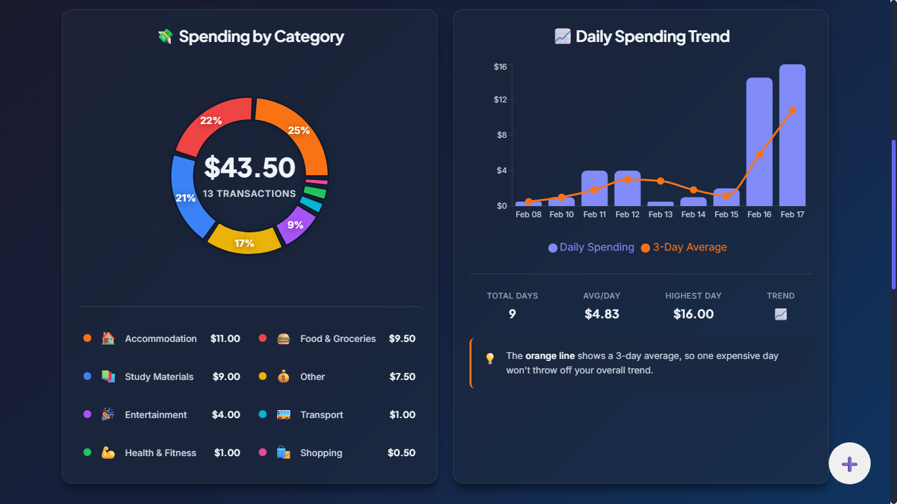
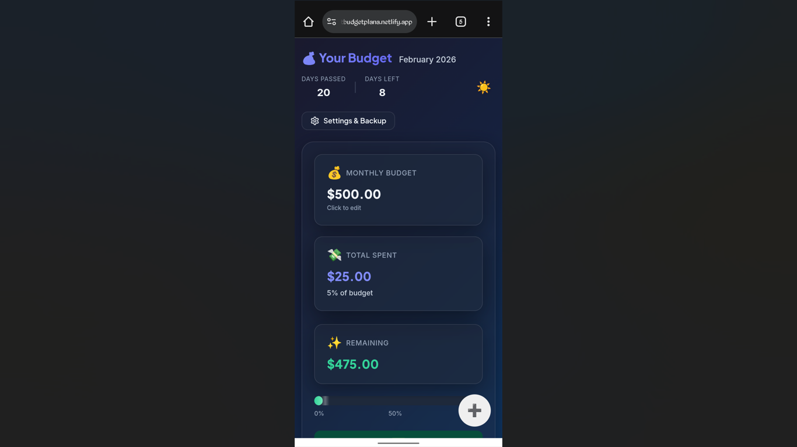
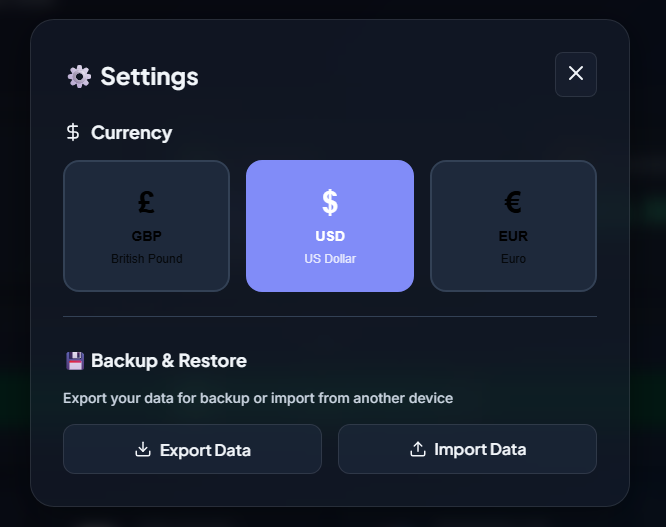

#  Student Budget Planner

A full-stack budget tracking application designed for students. Track expenses, visualize spending patterns, and stay on top of your finances, with a React frontend and a FastAPI backend.

<p align="center">
  <a href="https://budget-planner-prod.netlify.app" target="_blank" rel="noopener noreferrer">
    
  </a>
</p>

<p align="center" style="margin: -10px 0 30px 0; font-size: 1.1em; font-weight: 500; color: #555;">
  Experience the Student Budget Planner instantly - no sign-up, no install
</p>



##  Table of Contents

- [Features](#-features)
- [Live Demo](#-live-demo)
- [Screenshots](#️-screenshots)
- [Tech Stack](#️-tech-stack)
- [Architecture](#-architecture)
- [Getting Started](#-getting-started)
- [Environment Variables](#-environment-variables)
- [API Reference](#-api-reference)
- [Project Structure](#-project-structure)
- [Usage Guide](#-usage-guide)
- [Deployment](#-deployment)
- [Design Philosophy](#-design-philosophy)
- [Privacy & Data](#-privacy--data)
- [Troubleshooting](#-troubleshooting)
- [Git Workflow](#-git-workflow)
- [License](#-license)
- [Acknowledgments](#-acknowledgments)

---

##  Features

###  Expense Management
- **Quick Entry**: Add expenses in seconds with an intuitive form
- **Full Control**: Edit or delete any expense with ease
- **Smart Categories**: 8 pre-defined categories with emoji indicators
- **Date Tracking**: Record expenses with specific dates

###  Visual Insights
- **Spending Breakdown**: Pie chart showing expenses by category
- **Trend Analysis**: Chart displaying daily spending patterns
- **Real-time Stats**: Track total expenses, daily averages, and remaining budget

###  Budget Alerts
- **Traffic Light System**: Visual warnings when approaching budget limits
  - 🟢 Green: Under 70% of budget (safe)
  - 🟡 Yellow: 70-85% of budget (caution)
  - 🔴 Red: Over 85% of budget (warning)
- **Progress Bar**: Clear visualization of budget usage
- **Smart Messages**: Contextual feedback based on spending habits

###  Multi-Currency Support
- British Pound (£)
- US Dollar ($)
- Euro (€)
- Kenyan Shilling (KSh)

###  Themes
- **Light Mode**: Clean, bright interface for daytime use
- **Dark Mode**: Easy on the eyes for evening budgeting
- **Smooth Transitions**: Seamless switching between themes

###  Data Management
- **Server-Side Storage**: Expenses and budget are saved through a REST API to a PostgreSQL database
- **Per-Visitor Data**: Each browser gets an anonymous ID, so visitors only ever see their own data
- **Export**: Download your data as JSON for backup
- **Import**: Restore a backup on any device or browser

### Responsive Design
- Works on desktop, tablet, and mobile
- Touch-optimized interactions
- Adaptive layouts for all screen sizes

---

##  Live Demo

| Part | Link |
|------|------|
| Frontend (Netlify) | https://budget-planner-prod.netlify.app |
| Backend API (Railway) | https://student-budget-planner-production.up.railway.app |
| Interactive API docs | https://student-budget-planner-production.up.railway.app/docs |

---

##  Screenshots

### Dashboard Overview
*Main dashboard showing budget summary, spending insights, and charts*



### Light Theme
*Clean, bright interface perfect for daytime use*



### Add Expense
*Quick and intuitive expense entry form*



### Spending Charts
*Visual breakdown of spending by category and daily trends*



### Mobile View
*Fully responsive design that works on any device*



### Settings
*Currency selection and data backup options*



---

##  Tech Stack

**Frontend**
- **React 18** - UI framework
- **Vite** - Build tool and development server
- **Framer Motion** - Animations and transitions
- **Recharts** - Responsive charts
- **date-fns** - Date formatting and manipulation
- **Lucide React** - Icon library

**Backend**
- **FastAPI** - Python web framework for the REST API
- **SQLAlchemy 2** - Database access and models
- **Pydantic** - Request validation
- **Uvicorn** - ASGI server
- **PostgreSQL** - Production database (SQLite is used automatically for local development)

**Hosting**
- **Netlify** - Frontend
- **Railway** - Backend and PostgreSQL database

---

##  Architecture

```
Browser (React + Vite)  ──►  FastAPI backend  ──►  PostgreSQL
     │                           ▲
     └── X-Client-Id header ─────┘
```

- The frontend generates a random anonymous ID once per browser and sends it in an `X-Client-Id` header with every request.
- The backend filters every query by that ID, so each visitor's expenses and budget stay separate.
- Theme and currency are display preferences and stay in the browser's localStorage.

---

##  Getting Started

### Prerequisites
- [Git](https://git-scm.com/)
- Node.js 18 or higher (20 recommended) and npm
- Python 3.10 or higher (tested on 3.13)

### 1. Clone the repository
```bash
git clone https://github.com/AlgoPhoenix369/student-budget-planner.git
cd student-budget-planner
```

### 2. Start the backend
Open a terminal in the project folder:

```bash
cd backend
python -m venv .venv
```

Activate the virtual environment:

```bash
# macOS / Linux
source .venv/bin/activate

# Windows (PowerShell)
.\.venv\Scripts\Activate.ps1
```

Install the dependencies and run the server:

```bash
pip install -r requirements.txt
uvicorn app.main:app --reload --port 8000
```

The API is now running at `http://localhost:8000`, and the interactive docs are at `http://localhost:8000/docs`. With no extra setup, it stores data in a local SQLite file (`budget.db`) that is created automatically.

### 3. Start the frontend
Open a **second** terminal in the project root:

```bash
npm install
npm run dev
```

Open `http://localhost:3000` in your browser. The frontend talks to `http://localhost:8000` by default, so keep the backend running.

> The backend only accepts requests from `http://localhost:3000` and `http://127.0.0.1:3000` by default. If your frontend runs on another port, set `CORS_ORIGINS` (see below).

### Building for Production
```bash
npm run build
```
The production-ready frontend files will be in the `dist` folder.

---

## 🔧 Environment Variables

### Frontend (project root, optional for local development)
Copy `.env.example` to `.env` to change the backend address.

| Variable | Description | Default |
|----------|-------------|---------|
| `VITE_API_URL` | Address of the backend API, without a trailing slash | `http://localhost:8000` |

Vite reads this variable when the app is built, so rebuild or redeploy the frontend after changing it.

### Backend (`backend/`, optional for local development)
Copy `backend/.env.example` to `backend/.env` to change these settings.

| Variable | Description | Default |
|----------|-------------|---------|
| `DATABASE_URL` | Database connection string. PostgreSQL URLs starting with `postgres://` or `postgresql://` are supported | `sqlite:///./budget.db` |
| `CORS_ORIGINS` | Comma-separated list of frontend addresses allowed to call the API | `http://localhost:3000,http://127.0.0.1:3000` |

Never commit a real `.env` file. It is already listed in `.gitignore`.

---

## 📡 API Reference

All `/api/expenses`, `/api/budget` and `/api/backup` requests require an `X-Client-Id` header (16 to 64 letters, numbers, `_` or `-`). The frontend sends it automatically.

| Method | Endpoint | Description |
|--------|----------|-------------|
| `GET` | `/api/health` | Health check |
| `GET` | `/api/expenses?year=2026&month=10` | List expenses, optionally for one month (month is 1-12) |
| `POST` | `/api/expenses` | Create an expense |
| `PUT` | `/api/expenses/{id}` | Update an expense |
| `DELETE` | `/api/expenses/{id}` | Delete an expense |
| `GET` | `/api/budget` | Get the monthly budget (defaults to 500) |
| `PUT` | `/api/budget` | Set the monthly budget |
| `GET` | `/api/backup` | Export all expenses and the budget |
| `POST` | `/api/backup/import` | Replace expenses (and optionally the budget) from a backup |

Example expense body:
```json
{
  "amount": 12.5,
  "category": "food",
  "description": "Lunch at cafeteria",
  "date": "2026-10-01"
}
```

Valid categories: `food`, `transport`, `study`, `accommodation`, `entertainment`, `health`, `shopping`, `other`.

The full interactive documentation is available at `/docs` on the running backend.

---

## 📂 Project Structure
```
student-budget-planner/
├── backend/
│   ├── app/
│   │   ├── routers/
│   │   │   ├── expenses.py     # Expense endpoints
│   │   │   ├── budget.py       # Monthly budget endpoints
│   │   │   └── backup.py       # Backup export and import endpoints
│   │   ├── config.py           # Database URL, CORS origins, categories
│   │   ├── database.py         # SQLAlchemy engine and sessions
│   │   ├── deps.py             # X-Client-Id dependency
│   │   ├── main.py             # FastAPI app entry point
│   │   ├── models.py           # Expense and Budget tables
│   │   └── schemas.py          # Request and response validation
│   ├── .env.example
│   └── requirements.txt
├── public/                     # Favicon and app icons
├── src/
│   ├── components/
│   │   ├── Dashboard/          # Main dashboard component
│   │   ├── BudgetSummary/      # Budget cards and progress bar
│   │   ├── BudgetModal/        # Budget editor modal
│   │   ├── ExpenseForm/        # Add/edit expense form
│   │   ├── ExpenseList/        # Expense list with pagination
│   │   ├── Charts/             # Pie and trend charts
│   │   └── Settings/           # Settings and backup modal
│   ├── hooks/
│   │   └── useTheme.js         # Theme management hook
│   ├── utils/
│   │   ├── api.js              # Backend API client
│   │   ├── clientId.js         # Anonymous per-browser ID
│   │   ├── constants.js        # App constants and categories
│   │   ├── calculations.js     # Budget calculations
│   │   └── localStorage.js     # Theme and currency preferences
│   ├── styles/
│   │   ├── variables.css       # CSS custom properties
│   │   └── global.css          # Global styles
│   ├── assets/                 # Banner and screenshots
│   ├── App.jsx                 # Root component
│   └── main.jsx                # Entry point
├── .env.example
├── eslint.config.js
├── index.html
├── netlify.toml
├── package.json
├── vite.config.js
└── README.md
```

---

##  Usage Guide

### Setting Your Budget
1. Click on the **Monthly Budget** card
2. Enter your desired budget amount
3. Click **Save Budget**

### Adding an Expense
1. Click the **+** button (bottom-right corner)
2. Fill in the amount, category, description, and date
3. Click **Add Expense**

### Editing an Expense
1. Find the expense in the list
2. Click the **pencil icon**
3. Make your changes
4. Click **Update**

### Deleting an Expense
1. Find the expense in the list
2. Click the **trash icon**
3. Confirm deletion

### Changing Currency
1. Click **Settings & Backup** button
2. Select your preferred currency (GBP, USD, EUR or KES)
3. The page will reload with your new currency

### Backing Up Your Data
1. Click **Settings & Backup** button
2. Click **Export Data**
3. Save the JSON file to a safe location

### Restoring Data
1. Click **Settings & Backup** button
2. Click **Import Data**
3. Select your previously exported JSON file

Importing replaces your current expenses with the ones in the file.

### Switching Themes
- Click the sun ☀️ or moon 🌙 emoji in the top-right corner

---

##  Deployment

### Backend on Railway
1. Create a Railway project and add a **PostgreSQL** database.
2. Add a new service from this GitHub repository.
3. In the service settings, set:
   - **Root Directory**: `/backend`
   - **Branch**: `main`
   - **Custom Start Command**: `python -m uvicorn app.main:app --host 0.0.0.0 --port ${PORT:-8000}`
4. In the service variables, add:
   - `DATABASE_URL` = `${{Postgres.DATABASE_URL}}` (replace `Postgres` with your database service name)
   - `CORS_ORIGINS` = your frontend address, for example `https://budget-planner-prod.netlify.app`
5. Generate a public domain and point it at the port shown in the deploy log (Railway sets the port itself).
6. Open `/api/health` on the domain to confirm it returns `{"status":"ok"}`.

### Frontend on Netlify
1. Import this GitHub repository as a new Netlify project.
2. Set the build command to `npm run build` and the publish directory to `dist`. These are also defined in `netlify.toml`.
3. Add the environment variable `VITE_API_URL` with your Railway backend address (no trailing slash).
4. Deploy. If you change `VITE_API_URL` later, trigger a new deploy so the change is built in.

---

##  Design Philosophy

### Color-Coded Categories
Each expense category has a unique color for easy visual identification:
-  Food & Groceries (Red)
-  Transport (Cyan)
-  Study Materials (Blue)
-  Accommodation (Orange)
-  Entertainment (Purple)
-  Health & Fitness (Green)
-  Shopping (Pink)
-  Other (Gold)

### Glassmorphism UI
Modern glass-like effects with subtle transparency and backdrop blur create a contemporary, professional aesthetic.

### Accessibility
- Keyboard navigation support
- ARIA labels for screen readers
- Color-blind friendly (not relying on color alone)
- High contrast text for readability

---

##  Privacy & Data

- **No Account Required**: Start using immediately without signup
- **Anonymous by Design**: Your data is tied to a random ID stored in your browser, not to your name or email
- **No Tracking**: No analytics or third-party tracking
- **Your Data, Your Control**: Export your data as JSON at any time

**Design note:** this version deliberately skips user accounts so anyone can try it instantly. The anonymous ID works like a key, not a password, and clearing your browser's site data loses access to your saved data, so export a backup regularly.

**Planned improvement:** add user accounts with secure login (JWT authentication) so data follows the user across devices.

---

##  Troubleshooting

### "Could not reach the server" banner
- Make sure the backend is running (`uvicorn app.main:app --reload --port 8000` inside `backend/`).
- Check that `VITE_API_URL` points to the correct address, then restart the frontend.
- Click **Retry** once the backend is up.

### CORS errors in the browser console
- The frontend address must exactly match an entry in `CORS_ORIGINS` (including `https://` and with no trailing slash).
- Locally, run the frontend on port 3000, or add your port to `CORS_ORIGINS`.

### `uvicorn` or `pip` not found
- Activate the virtual environment first (see [Getting Started](#2-start-the-backend)). Your terminal prompt should show `(.venv)`.

### Data Not Showing After Refresh
- Check the backend is running and reachable.
- Make sure you aren't in a private/incognito window, which starts with a fresh anonymous ID each time.

### Charts Not Displaying
- Make sure you have added at least one expense in the selected month.
- Try refreshing the page.

### Currency Not Changing
- The page should automatically reload after selecting a currency.
- If not, manually refresh the page.

---

##  Git Workflow

This project was built using a feature-branch workflow:

1. Create a feature branch for every piece of work (for example `feature/backend-api`)
2. Push the changes to that branch
3. Open a pull request from the feature branch into `develop`
4. Open a release pull request from `develop` into `main`

Direct pushes to `develop` and `main` are not used.

---

##  License

This project is licensed under the MIT License.

---

##  Acknowledgments

- Icons by [Lucide](https://lucide.dev/)
- Fonts by [Google Fonts](https://fonts.google.com/)
- Charts powered by [Recharts](https://recharts.org/)
- Animations by [Framer Motion](https://www.framer.com/motion/)
- API built with [FastAPI](https://fastapi.tiangolo.com/)

---

<p align="center">Made with 💜 for students</p>
<p align="center">© 2026 Student Budget Planner</p>